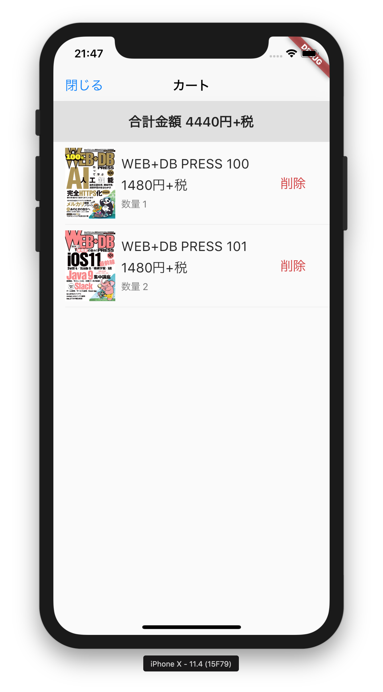
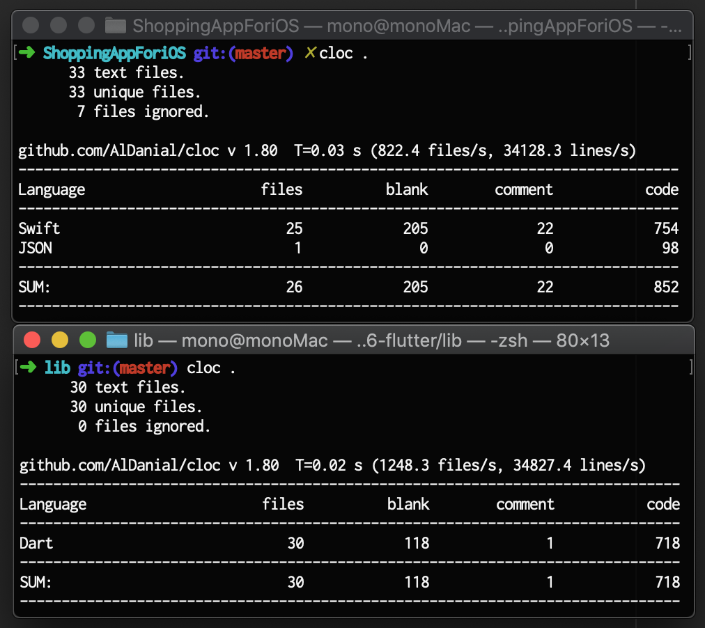

# wdb106_sample

- [WEB+DB PRESS Vol.106](https://www.amazon.co.jp/dp/4774199435?tag=mono0926-22) の特集1の「実践Android/iOSアプリ設計」のサンプルをFlutterではどう書くのかというサンプル
  - 元のサンプルは [サポートページ：WEB+DB PRESS Vol.106](http://gihyo.jp/magazine/wdpress/archive/2018/vol106/support) からダウンロード可能

## 内容概要

- BLoC(Business Logic Component)パターンを利用
- 自動テストをほぼ網羅
  - 自動スモークテスト(Widgetテスト)も対応
- JSON APIは http://www.mocky.io で用意

商品リスト | カート
--- | ---
 | 

## コード量比較(あくまで一つの目安)

- [cloc](https://github.com/AlDanial/cloc)で計測したところ、iOSネイティブのfluxサンプルのSwiftコードと比べて、FlutterのDartコードの方が若干少ない
  - iOSネイティブの方はStoryboardなどの画面コードが別途あるが、Flutterはコードにすべて含まれていることを考慮するとかなりコンパクトに書けている
  - (iOSネイティブのmvvmサンプルは未実装部分があったので割愛)

## Getting Started

For help getting started with Flutter, view our online
[documentation](https://flutter.io/).
